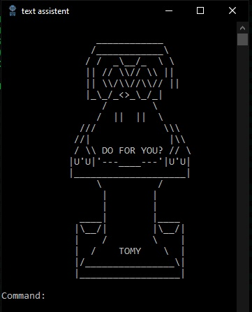
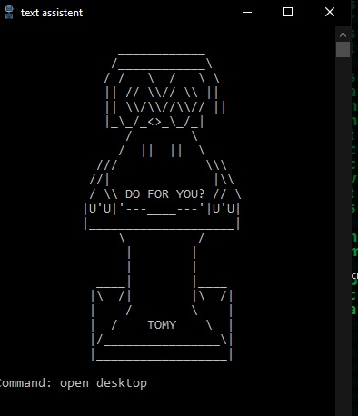
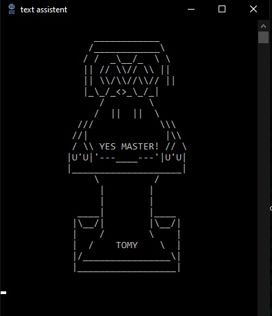
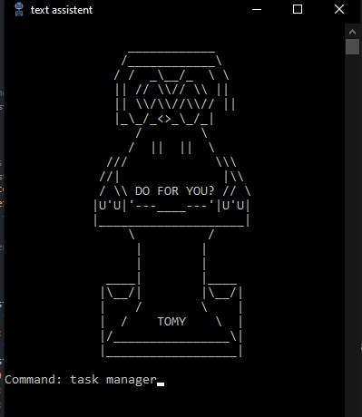
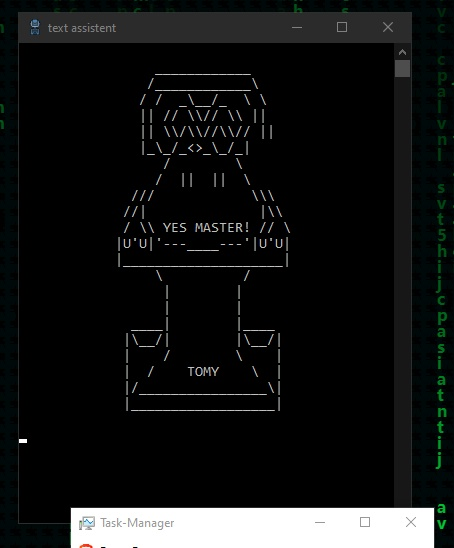

# Python Text Assistant

<div align="center">
  
</div>


Python Text Assistant is a simple script that acts as a text assistant. With this script, you can enter commands and use the assistant to perform specific actions. 

This README document gives you an overview of the functionality of the assistant and how you can customize it to your own needs

## Inhaltsverzeichnis

- [Installation](#Installation)
- [Usage](#Usage)
- [Customization](#Customization)
- [Dependencies](#Dependencies)

## Installation

1. **Clone the Repository**: Begin by cloning the repository to your local machine using Git:
    ```
    git clone https://github.com/Ppaja/text-assistant-dev
    ```

    or download the ZIP-file. 

2. **Install Dependencies**: Install the required libraries by running the following command in your terminal:
    ```
    pip install -r requirements.txt
    ```

3. **Create a Shortcut**: For easy access, create a shortcut to `startenglish.bat`, and you can place it on your desktop.

## Usage

1. **Launch the Assistant**: Run the assistant by executing `startenglish.bat` or the shortcut you created.

2. **Enter Commands**: Enter your commands in the provided input prompt.

3. **Enjoy the Features**: The assistant executes tasks and provides voice responses as needed.

4. **Customize**: Modify the script (assistanteng.py) to add your commands and customize the assistant to meet your requirements.

## Customization

You can customize the Python Text Assistant by following these steps:

1. **Edit Commands**: In the script (assistanteng.py), you'll find a section for different tasks with predefined commands. Add or modify commands to suit your needs. (most of the code is ASCII art, scroll down to the bottom to see the actual script)

2. **Voice Responses**: Customize the audio responses by editing the `audio_files` section. Define voice responses for your added commands.

3. **TTS Configuration**: Adjust the TTS engine settings, such as speech rate or language, according to your preferences.

4. **ASCII Art**: Enhance the user experience by adding your ASCII art for various sections.

5. **Save Your Changes**: Save the script after customizing it to your liking.

## Dependencies

To run the Python Text Assistant, you'll need Python (and maybe git to clone the project with git clone)


## Example Commands

The assistant recognizes a range of commands, including:

- "google": Opens a google search based on users input.
- "shut down": Shuts down the computer.
- "code": starts a VS Code launcher that will open a project folder based on user imput or create a new one to and open VS Code in that folder. (to custumize go to skills\VS-Code-Starter and edit the .bat files)
- "your command": A placeholder command you can personalize.

Feel free to add your own commands to extend the assistant's functionality.

## Showcase

<div align="center">
  
  
  
  

</div>

---

Thank you for choosing the Python Text Assistant. We hope this tool enhances your productivity and meets your needs. If you have questions or feedback, please reach out.

<div align="center">
  <p>Made with ❤️ by Ppaja</p>
</div>
